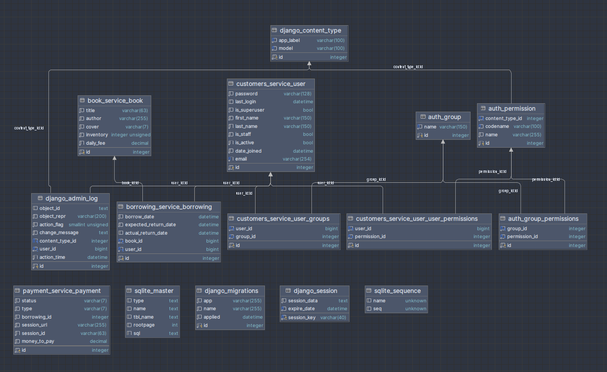

# library-service-api

Library API Service is a Django-based RESTful API for managing books borrowing and more. It optimizes the work of library administrators and make the service much more user-friendly.

## Installation

Python3 must be already installed

For Windows:
```shell
git clone https://github.com/MarianKovalyshyn/library-service-api.git
cd library-service-api
python venv venv
venv\Scripts\activate
pip install -r requirements.txt
python manage.py makemigrations
python manage.py migrate
python manage.py runserver
```
For Mac (and Linux):
```shell
git clone https://github.com/MarianKovalyshyn/library-service-api.git
cd library-service-api
python3 -m venv venv
source venv/bin/activate
pip install -r requirements.txt
python manage.py makemigrations
python manage.py migrate
python manage.py runserver
```

## Features:
- Web-based
- Manage books inventory
- Manage books borrowing
- Manage customers
- Display notifications
- Handle payments

## Endpoints
   ```
   "book_service" : 
                "http://127.0.0.1:8000/api/book-service/books/"

   "borrowing_service" : 
                   "http://127.0.0.1:8000/api/borrowing-service/borrowings/"
                   "http://127.0.0.1:8000/api/borrowing-service/borrowings/{id}/return_borrowing/"
                   
   "customers_service": 
                   "http://127.0.0.1:8000/api/users/"
                   "http://127.0.0.1:8000/api/users/me/"
                   "http://127.0.0.1:8000/api/users/token/"
                   "http://127.0.0.1:8000/api/users/token/refresh/"

   "payment_service": 
                   "http://127.0.0.1:8000/api/payment-service/payments/"
  
   "documentation": 
                   "http://127.0.0.1:8000/api/doc/"
                   "http://127.0.0.1:8000/api/swagger/"
                   "http://127.0.0.1:8000/api/redoc/"                                          
   ```

## DB structure

